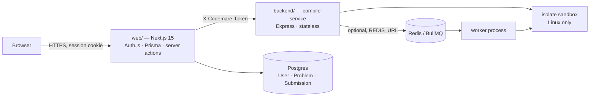
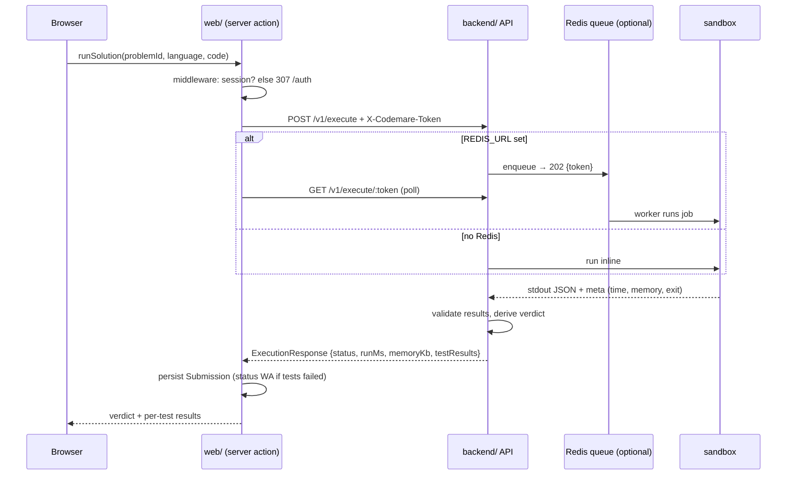

# Codemare — decisions, architecture, and what we learned

This is the "why" document. The README tells you how to run things; this
tells you why the system is shaped the way it is, what alternatives were
rejected, and which lessons were paid for with real bugs. Read it top to
bottom once to build intuition, then use it as a reference.

Everything here is grounded in the commit history (`git log --reverse`) and
the code as of September 2026.

---

## 1. What Codemare is, and how the goal moved

**Today:** a platform to practice DSA and competitive programming. You pick a
problem, write a solution in Python / JavaScript / C++ / Java, and a judge
tells you OK / WA / TLE / CE with *microsecond-accurate* timing of your
algorithm alone. There's also an IDE mode (free-form program + stdin →
stdout).

**Where it's going:** a content platform where users author "books" of
lessons and problems for others (v1 free; monetization designed for, not
built — see `authoring-v1.md`).

The goal moved three times, and each move explains a chunk of the codebase:

| Phase | Goal | What it left behind |
|---|---|---|
| Nov 2025 | A resume project: Express backend + Vite SPA, Docker executors | `frontend/` (legacy, retired), the `/api/*` route alias |
| May 2026 | A *production* judge: accurate timing, no Docker, real deploy | `isolate` sandbox, two-service split, Next.js `web/` |
| Jun–Jul 2026 | A *product*: auth, content pivot, QA-gated release, CI | Login wall, Postgres, agent-driven QA process, GitHub Actions |

---

## 2. System at a glance



Two services, one shared secret:

- **`web/`** owns *identity and state*: who you are, what you submitted, the
  UI. It is the only thing the browser talks to.
- **`backend/`** owns *execution*: take `(language, code, tests)`, run it in
  a sandbox, return a verdict with timing. It has no database, no users, no
  sessions. It doesn't know who you are — and that's deliberate (§4.3).

Ports in dev: web `4001`, backend `4000`. Postgres `5432`, Redis `6379`.

---

## 3. What happens when you press Submit

Follow one submission end to end; most of the design decisions become
obvious once you can picture this path.



Inside the backend, step by step (`executionService.ts`):

1. **Validate** — code ≤ 10 KB, non-empty, known language, known problem.
2. **Wrap** (`codeWrapperService.ts`) — the user's *function* is embedded in a
   generated program (the "harness") that calls it once per test case, times
   each call, compares the result, and prints one line of JSON.
3. **Sandbox** (`sandboxService.ts` → adapter) — compile if needed, then run
   under limits. Returns stdout plus the sandbox's own status/timing.
4. **Validate results** (`validationService.ts`) — re-check each test's output
   server-side (never trust the harness alone), honoring `compareMode`.
5. **Derive the verdict** — the sandbox says `OK` for *any clean exit*; the
   judge turns that into `WA` when tests failed (§5.2).

---

## 4. Decision records

Each entry: the situation, the options, what we chose, and what it cost.

### 4.1 Replace Docker with `isolate`

**Situation.** The original executors ran each submission in a Docker
container. Timing was wrong — container startup (hundreds of ms) dwarfed the
algorithm — and "very accurate" was a hard requirement.

**Options.** (a) Keep Docker, subtract a measured baseline. (b) Firecracker /
gVisor micro-VMs. (c) `isolate` (the IOI contest sandbox: namespaces +
cgroups v2, used by real judges). (d) No sandbox.

**Choice.** `isolate`. It boots in ~1 ms, meters CPU time and peak memory via
cgroups, writes a machine-readable meta file, and is what competitive-
programming judges already trust. Firecracker was overkill for a single VM;
subtracting a Docker baseline is guesswork.

**Consequences.** Linux-only in production (macOS dev needs the local
adapter, §4.4). Per-submission cost dropped from ~300 ms to a few ms of
overhead. Pinned config lives in `backend/src/config/sandbox.ts`:

| Phase | CPU time | Wall time | Memory | PIDs |
|---|---|---|---|---|
| run | 10 s | 20 s (2× CPU) | 256 MB | 50 (then per-language cap) |
| compile | 15 s | 30 s | 512 MB | 16 |

### 4.2 Measure the algorithm, not the process

**Situation.** Even with a 1 ms sandbox, "time" for Python included
interpreter startup (~20 ms) — useless for comparing O(n) vs O(n log n) on
small inputs.

**Choice.** Two clocks, reported separately:

- `runMs` — measured *inside* the user process, around the function call
  only: `time.perf_counter_ns()` (Python), `process.hrtime.bigint()` (JS),
  `std::chrono::steady_clock` (C++), `System.nanoTime()` (Java).
- `wallMs` / `compileMs` — from the sandbox meta file, kept as diagnostics.
  Compile time is *never* charged to the user.

Memory follows the same idea: `tracemalloc` peak (Python), heap delta (JS),
`getrusage` RSS (C++, best-effort), `0` (Java — JVM heap is too noisy per
call).

**Lesson.** The sandbox can only meter the whole process; the harness is the
only place that can meter the algorithm. Both numbers are needed and they
answer different questions.

### 4.3 Fairness: one core, tight PID caps

**Situation.** With accurate timing, the next question is whether a user can
cheat it by parallelizing.

**Choice.** Every run box is pinned to a single host core (`--core=N`,
round-robin), so threads can't win a timing comparison. PID caps are
defense-in-depth and a fork-bomb stop, set per language to what the runtime
itself needs (`languageSpec.ts`):

| Language | PID cap | Why |
|---|---|---|
| C++ | 1 | Truly single-threaded; `std::thread` is denied |
| Python | 1 | GIL anyway; blocks `multiprocessing` |
| JavaScript | 16 | Node needs ~7 threads just to boot (libuv, V8 GC) |
| Java | 64 | JVM spawns ~25 internal threads (GC, JIT, finalizer…) |

### 4.4 The two adapters: `isolate` in prod, `local` in dev

**Situation.** `isolate` doesn't run on macOS, and the team develops on macOS.

**Choice.** A `SandboxAdapter` interface with two implementations.
`isolateAdapter` is production; `localAdapter` runs code via
`child_process.spawn` with *no* isolation, prints a loud warning on boot, and
**refuses to start if `NODE_ENV=production`**. Selection is automatic
(isolate present → use it), overridable with `SANDBOX_MODE`.

**Consequences.** Development works anywhere, and the harness-level timing
is still real under the local adapter. The price: anything specific to
isolate (memory-cap kills, cgroup timing, artifact copying between boxes)
is untestable locally. That gap bit us once (§6, the Java `*.class` glob) and
is why the release plan demands an isolate smoke test on Linux.

### 4.5 Compile cache and parallel IDE cases

**Situation.** C++ compile is ~500 ms; users re-run unchanged code
constantly; IDE mode ran its test cases one after another.

**Choice.** A content-addressed compile cache keyed on
`sha256(language + compiler argv + source)`, single-flight (concurrent
identical compiles wait for one), bounded LRU (256 entries), shared by both
adapters. IDE test cases run in parallel.

**Result.** ~10× faster C++ re-runs; ~4× faster multi-case IDE runs.

### 4.6 Split into two services with an internal token

**Situation.** The original monolith mixed "run untrusted code" with "manage
users". Those have opposite scaling and security profiles.

**Choice.** `backend/` became a stateless compile service; `web/` (Next.js)
holds everything user-facing. They share one secret, `INTERNAL_TOKEN`, sent
as `X-Codemare-Token` and compared timing-safely. The token lives only in
server code (`web/lib/compile.ts` is `server-only`), never in the browser.

**Rules that fell out of this:**
- Dev with no token set is "open" — but production with no token **throws at
  boot** on both sides (the web guard also rejects placeholder values).
- The compile service is identity-blind. It can be scaled horizontally or
  swapped without touching auth.
- `ALLOWED_ORIGINS` CORS is effectively moot (server-to-server), kept for
  the legacy alias.

### 4.7 Optional Redis queue, not mandatory

**Situation.** Burst load (a class submitting at once) would pile onto a
single VM.

**Choice.** BullMQ over Redis, **gated entirely on `REDIS_URL`**. Unset →
everything is synchronous, exactly as before; set → `POST /v1/execute`
returns `202 {token}` and the client polls, or forces sync with
`?wait=true`. Workers run as a separate process (`npm run worker`) or inline
(`WORKER_INLINE=true`) for a single-VM deploy. `GET /v1/queue/stats` exposes
depth for tuning.

**Why optional.** One VM handles the first thousand users; forcing Redis on
day one adds an operational dependency for nothing. The web client handles
both modes transparently, so turning it on later is a config change.

### 4.8 Next.js App Router with server actions

**Situation.** The Vite SPA would have needed its own API layer to hold
sessions and call the compile service without leaking the token.

**Choice.** Next.js 15 App Router. Server actions (`runSolution`,
`runIdeCode`, `signUp`) are the API — they run on the server, hold the
token, and talk to Postgres directly. Monaco for the editor; design tokens
as CSS variables from a Claude Design bundle, ported component by component.

**Consequence.** There is no public JSON API for the browser to call; that
is why the middleware can wall *all* of `/api` except `/api/auth`.

### 4.9 Auth: email/password on Postgres, JWT sessions, a login wall

**Situation.** The pivot to a content platform needs identity. OAuth alone
blocks anyone without a GitHub/Google account and needs client IDs to even
test.

**Choice.** Auth.js v5 with a Credentials provider — bcrypt (cost 12),
minimum 8-character passwords, sign-up as a server action — plus
GitHub/Google when configured. **JWT session strategy** (no session table
round-trip on every request). A middleware login wall: everything except
`/auth` redirects unauthenticated users.

**Consequence.** Self-hosting requires `trustHost: true` and this is where
the worst bug of the project hid (§6).

### 4.10 Product surface: remove what doesn't serve the mission

Removed the design-system page, the "µs-judge" badge, the "µs-precision"
brand panel; hid nav until login. Reasoning from the product pivot: the
judge's precision is an implementation virtue, not the pitch. The pitch is
*learn and practice*, and eventually *author and share*.

### 4.11 Generated C++/Java harnesses from a typed signature

**Situation.** Python and JS harnesses can call `f(*args)` on JSON values.
C++ and Java are statically typed; the harness must know that `nums` is a
`std::vector<int>` before it can compile.

**Options.** (a) Hand-write a harness per problem (doesn't scale to
user-authored content). (b) Parse JSON at runtime in C++/Java (needs a JSON
library in the sandbox, slow, fragile). (c) Give each problem a typed
`signature` and *generate* the program with test data embedded as typed
literals.

**Choice.** (c). Problems declare:

```json
"signature": { "params": [{"name":"nums","type":"int[]"},{"name":"target","type":"int"}],
               "returns": "int[]" }
```

with types from `int, long, double, bool, string, char` and their `[]` /
`[][]` forms. The generator emits `std::vector<int> nums0{2,7,11,15};` (or
`new int[]{...}`), calls the user function, times it, compares, prints the
same JSON schema the Python/JS harnesses use. Doubles compare with `1e-6`
tolerance in the harness.

**User-code convention** (content authors must follow this):
- C++: a free function `ret name(params)`, no `main`, no includes needed —
  the harness provides the full standard header set.
- Java: `class Solution { public static ret name(params) { ... } }` — not
  `public class`, method must be `static`.

**Consequence (JVM limit).** Java caps a method at 64 KB of bytecode; a
10k-element test literal in `main()` blew it. The generator now emits one
method per test and chunks big literals (≤ 400 scalars per builder method,
≤ 16 000 chars per string constant). A regression test `javac`-compiles the
generated harness for every large-literal problem.

### 4.12 Verdicts are derived, never echoed

**Situation.** The sandbox reports `OK` whenever the process exits 0 — which
a wrong answer does. For a while, failed submissions were stored and shown
as "Accepted".

**Choice.** `deriveVerdict()` in `validationService.ts`: sandbox `OK` +
all tests passed → `OK`; sandbox `OK` + any failure → `WA`; any other
sandbox status (`TLE`, `CE`, `RE`, `MLE`) passes through; a harness-declared
platform error → `XX`. The web app adds a defense-in-depth check before
persisting. See §5.2 for the full table.

### 4.13 Order-insensitive judging via `compareMode`

**Situation.** Two Sum says "return in any order" but the judge compared
`[0,1]` to `[1,0]` and failed correct solutions.

**Choice.** Optional per-problem `"compareMode": "unordered"`: arrays are
compared as multisets by sorting both sides on a canonical JSON key —
recursively — in the validator *and* in every language's harness. Default
stays ordered. Only set it when the statement promises any order.

### 4.14 Process: dev → QA → manager agents, then CI

**Situation.** With one human, self-review misses what an adversarial
second reader catches.

**Choice.** Work is split across agents with separate contexts: a *dev*
agent implements and self-verifies; an independent *QA* agent tries to break
it with a written test plan and reports P0–P2 defects; a *manager* triages,
routes fixes, and commits only after a re-verification pass. Then GitHub
Actions runs on every push: unit tests (with a JDK for the harness tests),
a **Linux e2e judge smoke** submitting real solutions in all four
languages, and the web build against a Postgres container.

**Why it earned its keep.** QA found 13 defects the developers' own
verification missed, including two P0s (§6); the cross-product QA pass
(new problems × new languages) found the JVM limit; CI on Linux found a
header bug that macOS could not (§6).

---

## 5. Reference: contracts that everything depends on

### 5.1 Problem JSON (`backend/src/data/problems/*.json`)

```
id, title, difficulty, description, examples[], constraints[]
functionName            camelCase; the harness calls this
signature               { params:[{name,type}], returns }  — required for C++/Java
compareMode?            "unordered" for any-order answers (default ordered)
testCases[]             { input:[...args], expectedOutput, hidden? }
starterCode             { python, javascript, cpp, java }  — must compile as-is
```

Hidden tests are stripped (`input: []`, `expectedOutput: null`) by the
`/v1/problems/:id` endpoint. Every test must have exactly one correct answer
under the statement — the "two valid pairs" bug (§6) is the reason this is
underlined.

### 5.2 Verdict semantics

| Status | Meaning | Who decides |
|---|---|---|
| `OK` | Clean exit **and** every test passed | judge (derived) |
| `WA` | Clean exit, at least one test failed or threw inside the harness | judge (derived) |
| `TLE` | CPU or wall limit hit; error reads "Time limit exceeded (N ms)" | sandbox |
| `CE` | Compiler non-zero exit; message is the compiler's | sandbox |
| `RE` | Process died (signal / non-zero) *outside* the harness's catch | sandbox |
| `MLE` | Memory cap hit (isolate only) | sandbox |
| `XX` | Platform-side failure (e.g. a problem with no signature submitted in C++) — not the user's fault | judge |

A per-test exception (`ZeroDivisionError`, `out_of_range: vector`,
`ArrayIndexOutOfBounds`) is caught by the harness and yields `WA` with the
message on that test — consistent across all four languages.

### 5.3 Compile-service API

```
GET  /health                     open
GET  /v1/problems                { problems: [...] }   ← object, not array
GET  /v1/problems/:id            sanitized problem
POST /v1/execute                 → ExecutionResponse, or 202 {token} if queued
POST /v1/execute?wait=true       force synchronous
GET  /v1/execute/:token          poll
POST /v1/ide/execute             free-form program + stdin cases
GET  /v1/queue/stats             { enabled, counts } (enabled:false w/o Redis)
```

All `/v1/*` require `X-Codemare-Token` in production. Errors are always
JSON: `400` bad JSON, `413` body > 1 MB, `429` rate limit (10 execute-family
requests / minute / IP), `500` opaque.

### 5.4 Environment variables

| Var | Where | Notes |
|---|---|---|
| `INTERNAL_TOKEN` | both | 64-hex; must match; prod refuses missing/placeholder |
| `COMPILE_SERVICE_URL` | web | e.g. `http://localhost:4000` |
| `DATABASE_URL` | web | Postgres |
| `AUTH_SECRET` | web | JWT signing |
| `SANDBOX_MODE` | backend | `isolate` / `local` (local refused in prod) |
| `REDIS_URL` | backend | enables the queue; `WORKER_INLINE=true` to run a worker in-process |
| `NODE_ENV=production` | both | turns soft warnings into hard failures |

---

## 6. Bugs that taught us something

These are the ones worth remembering, because each encodes a rule.

**Dev mode hides production bugs — twice.**
`npm run dev` (tsx) reads problem JSON from `src/`; `tsc` never copied it to
`dist/`, so every production deploy had a dead Problems API. Same shape in
the web app: Auth.js trusts any host in development, but in production it
threw `UntrustedHost` and the middleware **failed open** — the whole app was
served to anonymous visitors while login 500'd.
*Rule:* QA the production build (`npm run build && npm start`), not the dev
server. And write security middleware to fail *closed*.

**Never echo a lower layer's status as your verdict.**
Sandbox `OK` means "exited 0". The judge shipped it as "Accepted" for wrong
answers. *Rule:* every layer derives its own status from its own evidence.

**Test data must be unambiguous.**
Two Sum's hidden test 4 (`[1,5,3,7,9], 10`) had two valid pairs; a correct
brute-force solution was rejected on a test the user couldn't see.
*Rule:* hand-check every test against the statement's promises; when a
statement says "any order", the judge must honor it (`compareMode`).

**The cross product is where the bugs are.**
The Java harness passed on Two Sum; the new problems passed in Python. Only
Java × the new problems' 10k-element tests hit the JVM's 64 KB method
limit. *Rule:* when two features land together, QA their combination.

**macOS is not Linux.**
libc++ transitively includes `<unordered_map>`; libstdc++ doesn't. Correct
C++ solutions compiled locally and got `CE` on the Linux CI runner.
*Rule:* CI must run on the deployment OS, and the harness — not the user —
owns the includes.

**An open redirect hides in the friendliest feature.**
`/auth?next=<url>` sent users wherever `next` said, including off-site,
right after they typed a real password. *Rule:* sanitize redirect targets
to same-origin paths at the single point they're read.

**Stubs must compile.**
Java starter code with an empty body and a non-void return is a compile
error — a user pressing Run on an untouched template saw `CE` pointing at
harness line numbers. *Rule:* submit every starter verbatim in QA.

---

## 7. What's deliberately not done yet

- **Isolate smoke test on Linux** — the only untested code path; blocks a
  real production launch (release plan, Stage 1).
- **Auth rate limiting** — sign-up/login accept unlimited attempts.
- **Catalog into Postgres + pure-executor contract** — Phase A of
  `authoring-v1.md`; prerequisite for user-authored content.
- **Learn section**, **books/marketplace**, **monetization** — in that order.
- Double-returning problems: the harness tolerates `1e-6` but the server-side
  re-check is exact; none of the current problems return doubles.
- Local-adapter `memoryKb` units look off (dev-only; isolate meters properly).
- `frontend/` (legacy Vite SPA) is dead code awaiting deletion.

---

## 8. Glossary

- **Harness / wrapper** — the generated program that surrounds the user's
  function, runs the tests, times them, and prints JSON.
- **Adapter** — the sandbox driver (`isolate` in prod, `local` in dev).
- **Box** — one isolate sandbox instance; C++/Java use two (compile, run).
- **Meta file** — isolate's machine-readable record of time/memory/exit.
- **Problems mode vs IDE mode** — function-against-tests vs free program
  with stdin.
- **Signature** — a problem's typed parameter/return declaration; what lets
  C++/Java harnesses be generated.
- **compareMode** — ordered (default) or unordered array comparison.
- **Internal token** — the shared secret between `web/` and `backend/`.
